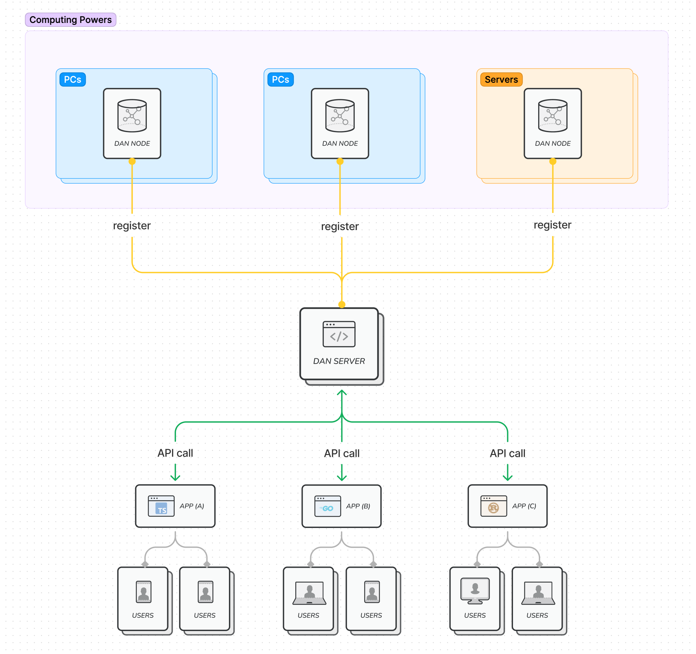

<p align="center"><a href="https://opendan.ai" target="_blank" rel="noopener noreferrer"></a></p>

<p align="center">
  <a href="https://github.com/fiatrete/DAN-Stable-Diffusion-Computing-Network/blob/main/LICENSE"></a>
  <a></a>
  <a href="https://github.com/fiatrete/DAN-Stable-Diffusion-Computing-Network/graphs/contributors"></a>
  <a href="https://github.com/fiatrete/DAN-Stable-Diffusion-Computing-Network/commits/main"></a>
</p>

<p align="center">
  <a href="https://www.opendan.ai" target="_blank">Website</a> |
  <a href="https://www.opendan.ai/play" target="_blank">Playground</a> |
  <a href="doc/api.md">API Docs</a>
</p>


## Overview

**[DAN](https://www.opendan.ai) is an infrastructure for sharing Stable Diffusion computing power**

- **Decentralization**: By running the DAN node program, users can register their idle computing resources with the DAN network
- **Trustlessness**: DAN abstracts the capabilities of Stable Diffusion into a set of atomic interface calls and hides the computing process from application developers
- **Powerful**: Application developers can quickly develop their own applications based on the Stable Diffusion related capabilities provided by DAN, without worrying about how these interfaces are implemented or how computing power is provided



- DAN Node
  - Executes image generation tasks
  - Use Stable Diffusion WebUI with API mode directly
- DAN Server
  - Manage and route image generation tasks to DAN Nodes
  - Hide the image generating details and expose a standard interface to application developers
  - Implement DAN server with openresty
- API
  - txt2img
  - img2img
  - integrate
  - more APIs under developing

**Why DAN?**

- Everyone should have the ability to use AI freely, AI will be a public good
- For the public, the cost of trying various ways of stable diffusion is too high
    - It's difficult to set up a stable diffusion runtime environment on your own
    - Computer performance may not support it
    - Downloading code from GitHub and running Stable Diffusion WebUI is beyond the ability of most non-programmers(even programmers)
    - Learning about models and prompt knowledge requires high learning costs
- More application developers should be supported in popularizing AI capabilities to the public
- For application developers, the cost of building a publicly available image generation service is too high
    - Application developers should focus on implementing business requirements
- The utilization of GPU computing power for home and cloud procurement is very low, leading to significant wastage

</br>

## Getting Started

Try out DAN functionalities in [DAN website](https://www.opendan.ai/).

🎈Feel free to file tickets for bugs or feature requests. 

</br>

## 📱 How-to: try out DAN API

DAN provide SaaS-like API from [https://api.opendan.ai](https://api.opendan.ai)


### Using `dan_run.py` script

Try the sample code in `example` folder. 

You can modify the `example/params-xxx.json` to experiment with different parameter combinations.

```bash
python3 dan_run.py txt2img params-txt2img.json OUTPUT_IMAGE.png
python3 dan_run.py img2img params-img2img.json ORIGINAL_IMAGE.png OUTPUT_IMAGE.png
```

### Using `curl`
1. Install `curl` and `jq`
```bash
brew install curl jq
```
2. Enter `example` folder and execute
```bash
cd example
cat params-txt2img.json \
| curl --location --request POST 'https://api.opendan.ai/txt2img' \
--header 'Content-Type: application/json' -d @- \
| jq '.images[0]' |tr -d '\"' | tr -d '\\' | base64 -d > out.png
```

👉 **DAN API** refer to [API Docs](doc/api.md)

</br>


## 🌐 How-to: contribute computing power to opendan.ai


1. Register a `donor account` on [opendan.ai](https://www.opendan.ai/) 
2. Install lastest [Stable Diffusion WebUI](https://github.com/AUTOMATIC1111/stable-diffusion-webui) on your PC or Server
3. Install the following models & loras::

- `chillout_mix`, [download](https://huggingface.co/fiatrete/dan-used-models/resolve/main/chilloutmix_NiPrunedFp32Fix.safetensors)
- `clarity`, [download](https://huggingface.co/fiatrete/dan-used-models/resolve/main/clarity.safetensors)
- `anything-v4.5-pruned`, [download](https://huggingface.co/fiatrete/dan-used-models/resolve/main/anything-v4.5-pruned.safetensors)
- `koreanDollLikeness_v10`, [download](https://huggingface.co/fiatrete/dan-used-models/resolve/main/koreandolllikeness_V10.safetensors)
- `stLouisLuxuriousWheels_v1`, [download](https://huggingface.co/fiatrete/dan-used-models/resolve/main/stLouisLuxuriousWheels_v1.safetensors)
- `taiwanDollLikeness_v10`, [download](https://huggingface.co/fiatrete/dan-used-models/resolve/main/taiwanDollLikeness_v10.safetensors)
- `kobeni_v10`, [download](https://huggingface.co/fiatrete/dan-used-models/resolve/main/kobeni_v10.safetensors)
- `thickerLinesAnimeStyle_loraVersion`, [download](https://huggingface.co/fiatrete/dan-used-models/resolve/main/thickerLinesAnimeStyle_loraVersion.safetensors)

4. Startup Stable Diffusion WebUI with `--listen --api --share` argument 

```bash
bash webui.sh --listen --api --share
```
> *You will get a public URL like `https://f00bfa54-7b3c-476b.gradio.live`*

5. Login `donor account` on [opendan.ai](https://opendan.ai) and register the public URL to `global node list`


<br>

## 🔨 How-to: run dan-server locally in Docker

1. Install lastest [Stable Diffusion WebUI](https://github.com/AUTOMATIC1111/stable-diffusion-webui) and [Docker](https://github.com/jenkinsci/docker) on your PC or Server

2. Install the following models & loras:

- `chillout_mix`, [download](https://huggingface.co/fiatrete/dan-used-models/resolve/main/chilloutmix_NiPrunedFp32Fix.safetensors)
- `clarity`, [download](https://huggingface.co/fiatrete/dan-used-models/resolve/main/clarity.safetensors)
- `anything-v4.5-pruned`, [download](https://huggingface.co/fiatrete/dan-used-models/resolve/main/anything-v4.5-pruned.safetensors)
- `koreanDollLikeness_v10`, [download](https://huggingface.co/fiatrete/dan-used-models/resolve/main/koreandolllikeness_V10.safetensors)
- `stLouisLuxuriousWheels_v1`, [download](https://huggingface.co/fiatrete/dan-used-models/resolve/main/stLouisLuxuriousWheels_v1.safetensors)
- `taiwanDollLikeness_v10`, [download](https://huggingface.co/fiatrete/dan-used-models/resolve/main/taiwanDollLikeness_v10.safetensors)
- `kobeni_v10`, [download](https://huggingface.co/fiatrete/dan-used-models/resolve/main/kobeni_v10.safetensors)
- `thickerLinesAnimeStyle_loraVersion`, [download](https://huggingface.co/fiatrete/dan-used-models/resolve/main/thickerLinesAnimeStyle_loraVersion.safetensors)

3. Startup Stable Diffusion WebUI with `--listen --api` argument 

```bash
bash webui.sh --listen --api
```

4. Start dan-server locally in docker with [Docker Compose](https://github.com/docker/compose):
```
docker-compose up -d 
```

>*Now your dan-server is available on "[http://127.0.0.1:8080](http://127.0.0.1:8080/)"*

5. Register your Stable Diffusion WebUI instance as a DAN node:

- Login your account using DAN's web page;
- Navigate to `Nodes` -> `Donate Node`
- Enter your worker node's address
- Click `Donate`

> ⚠️ *Please note that you must use non-loopback IP address! You cannot use 127.0.0.1 or 'localhost' since our docker container's `hostnet` is not enabled.* 


6. Config SERVICE_PREFIX in `example/dan_run.py` to "[http://127.0.0.1:8080](http://127.0.0.1:8080/)". 

```python
SERVICE_PREFIX = 'http://127.0.0.1:8080'
```

7. Execute the example with your local dan-server:

```bash
python3 dan_run.py txt2img params-txt2img.json OUTPUT_IMAGE.png
```

</br>


## Roadmap

- [ ] Rename project to DAN
- [x] Management GUI for computing power donors
    - [x] Add login to the DAN website
    - [x] CRUD management of computing power provided by donors
- [x] Workload ranking page
    - [x] Node-based workload ranking
    - [x] Donor-based workload ranking
    - [ ] Model-based workload ranking
    - [ ] API-based workload ranking
- [ ] Basic DAN functional interfaces
    - [ ] Scale interface
    - [ ] Inpaint interface
    - [ ] Support for controlnet
- [ ] Enrich examples in the playground
    - [ ] 2D to 3D style conversion
    - [ ] 3D to 2D style conversion
- [ ] One-click installation of Stable Diffusion WebUI as an DAN node (Windows & Linux supported)
    - [ ] Customize Stable Diffusion WebUI installer
    - [ ] Automatically download necessary model files
    - [ ] Customize DAN node daemon as intermediary for communication between Stable Diffusion WebUI and DAN server
- [ ] Image Stream (user generated by the DAN tool and share to opendan.ai)
    - [ ] Sharing mechanisms for images generated through API or playground
    - [ ] A page to display shared images in a waterfall flow
- [ ] Constraints for the use of computing resources
    - [ ] APP-Key mechanism
- [ ] Task scheduling mechanism
    - [ ] Schedule to nodes with required models already loaded
    - [ ] Global load balancing


</br>

## License

This project is licensed under the [MIT license]

[MIT license]: https://github.com/fiatrete/DAN-Stable-Diffusion-Computing-Network/blob/main/LICENSE

</br>

## Credits

- Stable Diffusion - https://github.com/CompVis/stable-diffusion
- Stable Diffusion web UI - https://github.com/AUTOMATIC1111/stable-diffusion-webui
- Ant Design - https://github.com/ant-design/ant-design
