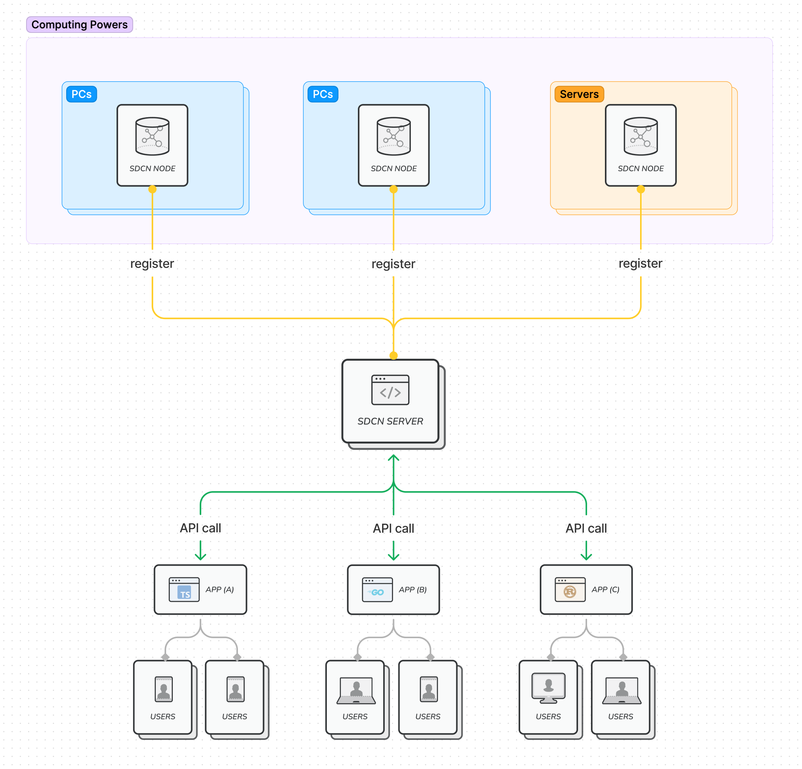

# SDCN

## **What is SDCN?**

- SDCN is an infrastructure for sharing stable diffusion computing power.
- By running the SDCN node program, users can register their idle computing resources with the SDCN network.
- SDCN abstracts the capabilities of stable diffusion into a set of atomic interface calls and hides the computing process from application developers.
- Application developers can quickly develop their own applications based on the stable diffusion-related capabilities provided by SDCN, without worrying about how these interfaces are implemented or how computing power is provided.

## **Why SDCN?**

- Everyone should have the ability to use AI freely. AI will be a public good.
- For the public, the cost of trying various ways of stable diffusion is too high.
    - It's difficult to set up a stable diffusion runtime environment on your own.
        - Computer performance may not support it.
        - Downloading code from GitHub and running Stable Diffusion webui is beyond the ability of most non-programmers(even programmers).
    - Learning about models and prompt knowledge requires high learning costs.
- More application developers should be supported in popularizing AI capabilities to the public.
- For application developers, the cost of building a publicly available image generation service is too high.
    - Application developers should focus on implementing business requirements.
- The utilization of GPU computing power for home and cloud procurement is very low, leading to significant wastage.

## **How does SDCN work?**



- SDCN Node
  - Executes image generation tasks
  - Currently, we use Stable Diffusion webui with API mode directly
- SDCN Server
  - Manage and route image generation tasks to SDCN Nodes
  - Hide the image generating details and expose a standard interface to application developers
  - Currently, we implement SDCN server with openresty
- API
  - Currently, only txt2img and img2img is implemeted

## **API reference**
refer to [API reference](doc/api.md).

## **How to use**

### Run sdcn-server locally in docker

I supose you have Stable Diffusion webui and docker installed.

1. make sure the following models & loras are installed:
    1. chillout_mix, [download](https://civitai.com/api/download/models/11745)
    2. clarity, [download](https://civitai.com/api/download/models/13128)
    3. koreanDollLikeness_v10, [download](https://civitai.com/api/download/models/8750)
    4. stLouisLuxuriousWheels_v1, [download](https://civitai.com/api/download/models/7840)
    5. taiwanDollLikeness_v10, [download](https://civitai.com/api/download/models/9070)
    6. kobeni_v10, [download](https://civitai.com/api/download/models/7852)
2. startup Stable Diffusion webui with `--api` argument 

```bash
bash webui.sh --listen --api
```

1. add your Stable Diffusion webui instance as a SDCN node in `sdcn-server/scripts/config.lua`

```lua
kBackEndWorkers = {
        "http://127.0.0.1:7860"
}
```

1. startup docker in port 6006

```bash
docker build -t sdcn .
docker run -d -p 6006:6006 sdcn:latest
```

Now your sdcn-server is available on "[http://127.0.0.1:6006](http://127.0.0.1:6006/)"

1. config SERVICE_PREFIX in example/sdcn_run.py to "[http://127.0.0.1:6006](http://127.0.0.1:6006/)"

```python
SERVICE_PREFIX = 'http://127.0.0.1:6006'
```

1. execute the example with your local sdcn-server:

```bash
sdcn_run.py txt2img params-txt2img.json OUTPUT_IMAGE.png
```

### For application developers

- The SDCN service is provided from [https://api.sdcn.info](https://api.sdcn.info)
- Try the sample code in folder example. You can modify the 'params-xxx.json' file to experiment with different parameter combinations.

```bash
sdcn_run.py txt2img params-txt2img.json OUTPUT_IMAGE.png
sdcn_run.py img2img params-img2img.json ORIGINAL_IMAGE.png OUTPUT_IMAGE.png
```

### For those who want to contribute computing power

## TODO list

- To be updated
